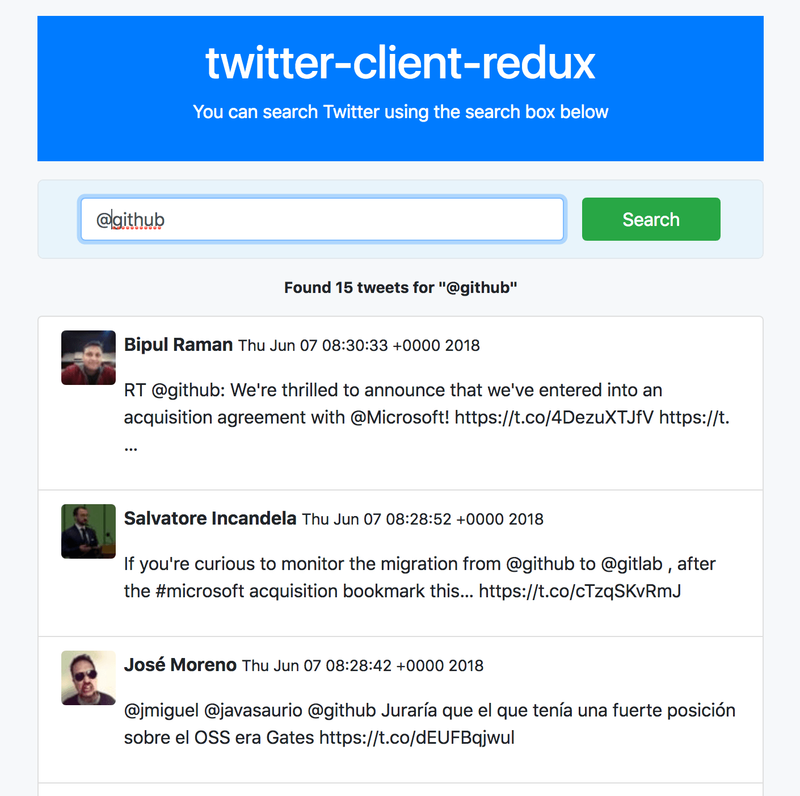

# twitter-client-redux

A [Redux async action](http://redux.js.org/docs/advanced/AsyncActions.html) example to search Twitter with [Twitter REST APIs](https://dev.twitter.com/rest/public)

 

## Features

- Redux async action
- Twitter REST APIs
- CSS modules
- Test with Jest
- Server side rendering (SSR)

Notes: We use `babel-node` for development (and build by `babel` for production). `babel` use `babel-plugin-css-modules-transform` to handle `scss` files then it ignores `style-loader` which loaded by `webpack-dev-middleware`. To support SSR we need to only use `webpack` for client side code.

## How to Start

`yarn install`

`yarn test`

`yarn start` to start an Express server at `http://localhost:8080` with [HMR](https://webpack.js.org/concepts/hot-module-replacement/) ([nodemon](https://github.com/remy/nodemon) is utilized for its live loading feature).

`yarn build` to build code for production mode e.g. use CSS file instead of inline style.

## Configuration

In order to run this application locally you need to [create a Twitter application](https://apps.twitter.com/app/new) in your own Twitter account then provide valid `CONSUMER_KEY` and `CONSUMER_SECRET` in `.env` file.

## Resources

- [Introduction to Redux](http://devguides.io/redux/)
- [Redux Official Documentation](https://redux.js.org/)
- [CSS Modules with React: The Complete Guide](https://blog.yipl.com.np/css-modules-with-react-the-complete-guide-a98737f79c7c)

&copy;2018 [Tien Do](https://github.com/tiendq)

MIT License.
